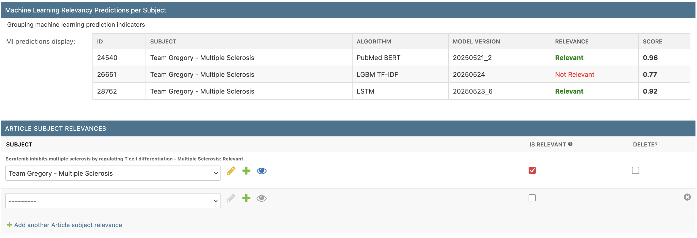
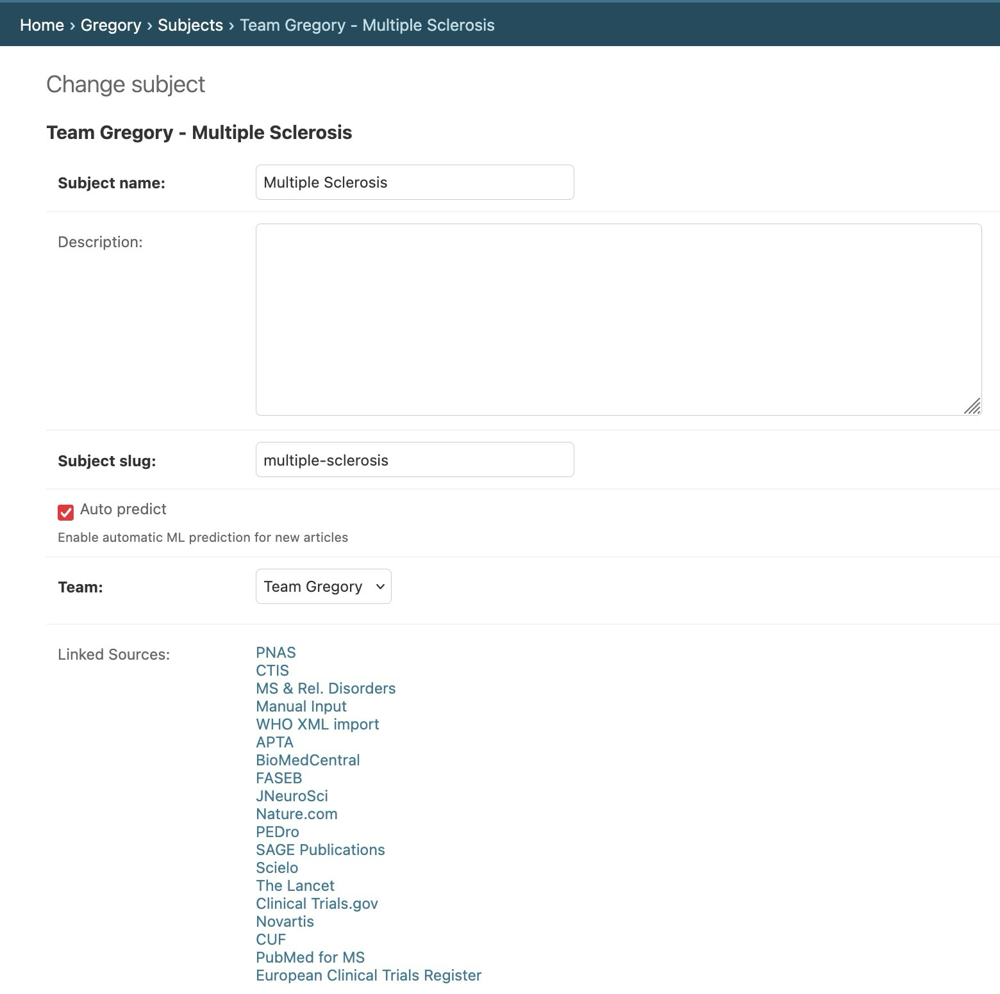

---
authors:
  - bruno-amaral
date: 2025-05-25T12:00:00Z
description: "Gregory AI has undergone significant improvements, introducing more accurate and tailored algorithms to help Multiple Sclerosis (MS) researchers quickly identify relevant studies."
draft: false
resources: 
- src: images/gregory-ai-research-papers-systematic-review.jpeg
  name: "header"
- src: "gallery/*.jpg"
  name: gallery-:counter
  title: gallery-title-:counter
slug: gregory-ai-update-better-algorithms-ms-researchers
subtitle: "Better Algorithms to Help MS Researchers Find Relevant Studies Faster"
tags: 
  - Gregory AI
  - Multiple Sclerosis
  - Research
  - Nova SBE
  - Machine Learning
  - Clinical Trials
categories: 
  - Updates
title: "Gregory AI Update"
layout: single
options:
  unlisted: false
  showHeader: true
  hideFooter: false
  hideSubscribeForm: false
  header: mini
scripts:
  -
---

Gregory AI went through significant improvements this week. We implemented more accurate algorithms to help Multiple Sclerosis (MS) researchers receive relevant studies, and added multi-team and multi-subject support so that Gregory can cover more than just MS. These updates, made possible by collaboration with Nova SBE, improve flexibility, performance, and accuracy, to the direct benefit of the MS community.

Gregory AI was created with a clear mission: to help Multiple Sclerosis (MS) researchers, patients, and caregivers find and track relevant scientific papers and clinical trials. Today, we're a tiny step closer to that goal.

### A Long-Overdue Improvement

We know this update was long overdue, and the reason was the substantial amount of rewriting and improvement our code required. 

### Thanks to Nova SBE

This milestone was made possible thanks to the expertise provided by NOVA School of Business and Economics (Nova SBE). They were instrumental in driving the research of new algorithms to enhance Gregory AI.

We extend our heartfelt thanks to:

* **Leid Zejnilovic**, **Lénia Mestrinho**, and **Susana Lavado**
* Master's students: **Nicolò Mazzoleni**, **Kuba Bialczyk**, **Julia Antonioli**, **Martim Esteves**, and **Francisco Gomes**
* Mentors: **Patrícia Xufre** (Data Science Mentor) and **Tiago Godinho** (Business & Management Mentor)

### What's New and How It Helps

#### More Accurate Results

Gregory AI can now more accurately identify studies relevant to MS and other research subjects, as long as we have enough training data. This means less time filtering through unrelated content, making it easier and faster for patients and researchers to access new research.

#### Improved Flexibility

We believe that other areas of medical research can benefit people with MS (PwMS). That's why this new update allows different teams to use GregoryAI without getting in each other's way. And there is more.

#### Tailored Predictions

Each research subject now benefits from having its own predictive model, trained with papers that reflect a specific goal. For example, within MS we can have a model focused on Disease Modifying Therapies (DMTs) or one focused on regenerating the myelin sheath.

### Behind the Scenes

The updated code was developed with the assistance of Claude 3.7 Sonnet under supervision by us. 

While the output is meeting our expectations, there are some concerns regarding code quality and adherence to the documentation provided by NOVA SBE. This is a concern that we will do our best to address from now on. 

We would never have been able to add the new features without the help of GenAI tools and, so far, the benefits outweight the risks.

### What This Means for You

* **Researchers**: Faster and more precise access to relevant MS research.
* **Patients and MS Communities**: Stay informed effortlessly about new and relevant clinical findings.

### Stay Informed with Gregory AI

Don't forget, you can subscribe to our free newsletters:

* [Clinical Trial Alerts](https://gregory-ms.com/patients/) 
* [Weekly Research Summaries](https://gregory-ms.com/researchers/) 

### Join Us in Shaping the Future

Gregory AI is fueled by hope and community support and we welcome any contribution in any form.

[You can support the project with a donation](https://donate.stripe.com/6oEeVmf1tdHIdOw7ss) and by sharing it with your network.

There is also a BlueSky and Mastodon account where you can follow us for updates: [@gregory-ms](https://bsky.app/profile/gregory-ms.com) and [@gregoryMS@med-mastodon.com](https://med-mastodon.com/@gregoryMS).

For more details or to contribute, visit our website or reach out directly to [team@gregory-ms.com](mailto:team@gregory-ms.com).

Thank you again to everyone who continues to support Gregory AI! 

— Bruno.

