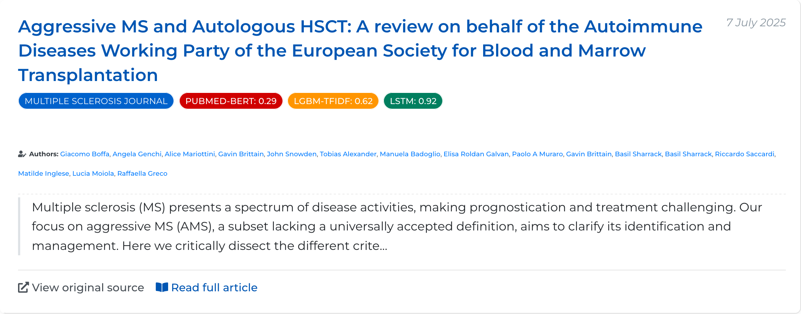
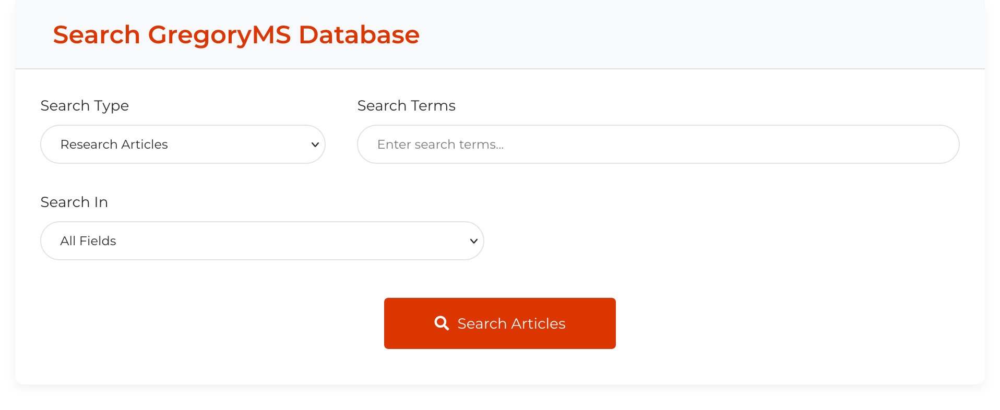
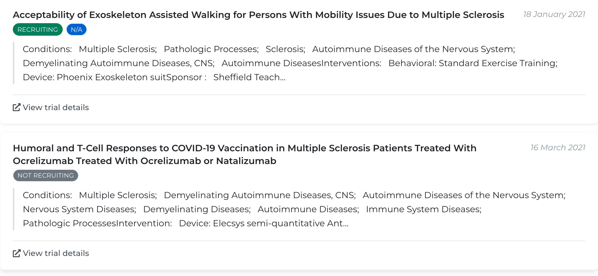
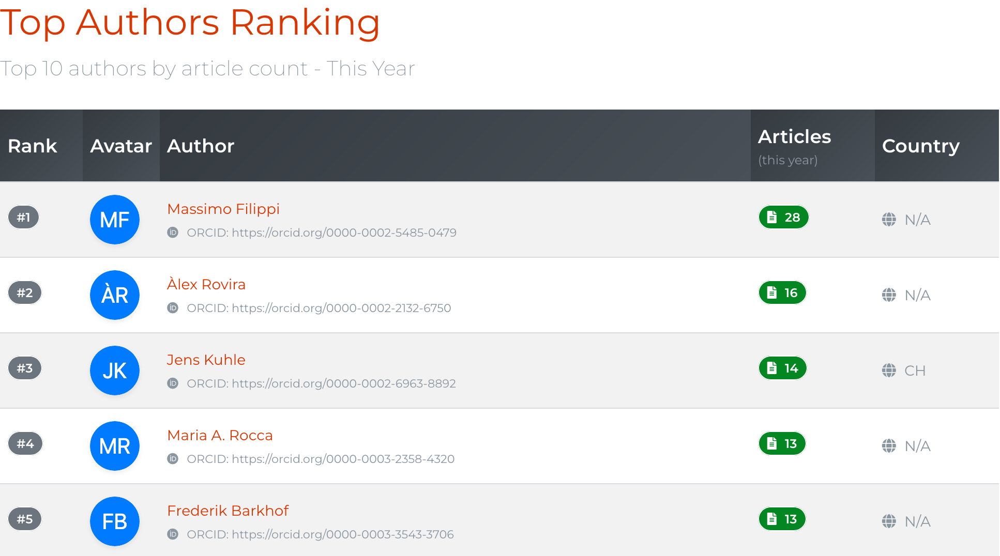
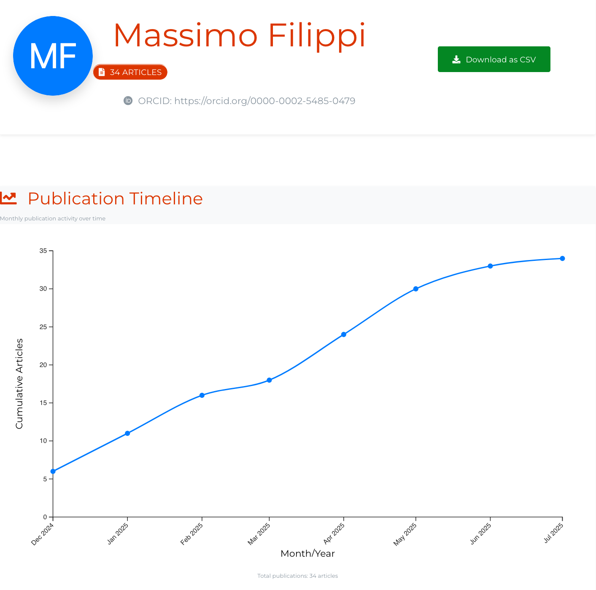

---
authors:
  - bruno-amaral
date: 2025-07-07T10:57:50+01:00
description: ""
draft: false

resources: 
- src: images/gregory-ms-sorting-articles.jpeg
  name: "header"
- src: "gallery/*.jpg"
  name: gallery-:counter
  title: gallery-title-:counter
- src:
  name: slide-1
slug:
layout: single
tags: 
  - Gregory AI
  - Multiple Sclerosis
  - Clinical Trials
  - Machine Learning
  - Nova SBE
categories: 
  - updates
title: "A Clearer View Into Multiple Sclerosis Research"
subtitle: "Our Recent Updates to the Gregory MS website"
options:
  unlisted: false
  showHeader: true
  hideFooter: false
  hideSubscribeForm: false
  header:
scripts:
  -
---

### First, an Apology{.title}

Tuesday, July 1st, we sent out the weekly email with the list of relevant articles for People with MS (PwMS). Only this time, the email had 249 articles, making it unusable.

This happened not because of an error but because we underestimated the amount of new relevant articles we would be picking up. Our previous improvements to Gregory AI included better algorithms and a few tweaks to the way we fetch articles. This was the real cause of the deluge. 

We apologise for this and have taken steps to prevent it from happening again.

From now on, there is a hard limit of 15 articles per email, which will be sorted from most to least relevant. 

Since we are now indexing more scientific papers, there is a small chance that one or more articles may not make the cut. To mitigate this problem, we have improved the way we list articles in the [Relevant Papers](/relevant/) section.

### Improvements to the Website{.title}

Gregory AI has been growing, and some of those improvements still weren’t visible on the website. So last week we did a full review of the content and how it is presented.

### Improvements to Articles{.title}

We have redesigned the way that articles are displayed to you, with the goal of making them easier to scan.

The new view includes a list of Machine Learning scores and the authors of the article. There is a small excerpt of the abstract and the option to open the original link.

Clicking on a single article takes you to a page with all the information we have.

- The main takeaways, extracted from the abstract using a summarisation algorithm.
- Full abstract.
- Authors.
- DOI reference.
- ML predictions of relevancy for PwMS.

### Better Search Page{.title}

This was a full rebuild of the search page that now allows searching for articles and clinical trials.

These changes were not just aesthetic; behind the scenes, we now search the database in real time and can allow you to export the search results as a CSV file that can be opened with Microsoft Excel or another similar app.

For Clinical Trials, we have added an indication of their status.

### Clinical Trials for Multiple Sclerosis{.title}

Trials are one of the biggest sources of hope for PwMS, and with that in mind, we also redesigned the listing of trials in our database.

At Gregory AI, we’re pulling clinical-trial data from several trusted registries to ensure we have the most up-to-date information. Right now, we’re extracting data from:

- **[EU Clinical Trials Information System (CTIS) Public API](https://euclinicaltrials.eu/ctis-public-api/)**

  (euclinicaltrials.eu)

- **[European Union Clinical Trials Register](https://www.clinicaltrialsregister.eu)**

  (clinicaltrialsregister.eu)

- **[ClinicalTrials.gov](https://clinicaltrials.gov/)**

  (clinicaltrials.gov)

- **[WHO International Clinical Trials Registry Platform](https://trialsearch.who.int/)**

  (trialsearch.who.int)

  This is a manual update.

Each of these registries has its own database model, and we do our best to consolidate all their information into Gregory AI. Still, issues may occur. 

In the future, the EU will migrate their data to CTIS. Right now, Gregory AI already has full support for when it happens.

### More Information About Authors{.title}

Gregory AI fetched information on more than 200,418 authors who have published research about MS and related disorders. The new update brings that information to the spotlight by allowing us to know who are the top authors and the articles they published.

You can find them on the new [author ranking page](/authors/ranking/), where we give you real-time data on who has made the most contributions.

The new Author profile page allows you to see their published papers and ORCID links.

The number of papers is not a perfect measurement of their contributions to finding a cure for MS. We are trying to find an answer to that question.

### Explaining our AI algorithms and Relevancy Badges

The relevancy badges shown on articles are generated by our machine learning algorithms that analyse the content of each paper. These predictions help identify papers that are most likely to be relevant for Multiple Sclerosis research and treatment.

#### ML Prediction Scores

Each badge represents a prediction score from our ML models, ranging from 0 to 1:

- 0.0 - 0.3 **Low relevance**
- 0.3 - 0.7 **Moderate relevance**
- 0.7 - 1.0 **High relevance**

Only the most recent prediction from each algorithm is shown for each article.

#### Our Algorithms

We use three machine learning models to analyse scientific papers:

- **TF-IDF + SVM**: A traditional ML approach using term frequency-inverse document frequency combined with a support vector machine classifier.
- **BERT**: A deep learning model pre-trained on a large corpus of text to understand context.
- **SciBERT**: A variant of BERT specifically trained on scientific papers for improved understanding of scientific terminology.

The use of these algorithms had the valuable help of [Nova SBE](https://www.novasbe.unl.pt/en/). Their Data Science Knowledge Center heard about our efforts to accelerate MS research and included it as part of their Project-Based Learning.

We would like to thank [Leid Zejnilovic](https://www.linkedin.com/in/leid-zejnilovic-78a0a15/), and [Lénia Mestrinho](https://www.linkedin.com/in/leniamestrinho/) for opening this door; [Patrícia Xufre](https://www.linkedin.com/in/patr%C3%ADcia-xufre-l2e45/) and [Tiago Godinho](https://www.linkedin.com/in/tiagobgodinho) who mentored their students;  And of course, [Francisco Lopes Natário Pinto Gomes](https://www.linkedin.com/in/francisco-lopes-nat%C3%A1rio-pinto-gomes/), [Julia Emma Maria Antonioli](https://www.linkedin.com/in/julia-antonioli/), [Kuba Maciej Bialczyk](https://www.linkedin.com/in/kuba-bialczyk/), [Martim Alves Ernesto Esteves](https://www.linkedin.com/in/martim-e-esteves/), [Nicolò Mazzoleni](https://www.linkedin.com/in/nicolomazzoleni); 

They all did more than just explore a dataset. Their questions and rhythm in taking on this project were invaluable.

### What is Next{.title}

This website and the whole of Gregory AI are still the work of a very small team. I have been taking care of the programming and development of new features, with the guidance of friends with much more knowledge than me.

The plan for the next months is to rebuild the Observatory page where we were listing research per category and medication. In the meantime, these last improvements forced us to remove that page for now.

The next version will be more focused in finding treatments for symptoms and revert the damage caused by MS.

Our endgame is not be a repository of research links, it's to help researchers find the cure for Multiple Sclerosis in any way we can.

    <h4 class="display-5">Support the Gregory MS Project</h4>
    
Your feedback and support is very much appreciated.
    

    

    This is an independent project and we rely on donations to cover infrastructure costs and keep delivering notifications of cutting-edge research and clinical trials.
    

    <a class="btn btn-info btn-lg mr-2" href="https://donate.stripe.com/6oEeVmf1tdHIdOw7ss" target="_blank" role="button">Donate</a>
    <a class="btn btn-success btn-lg" href="mailto:team@gregory-ms.com?subject=Gregory MS Feedback" role="button">Give Feedback</a>
    <a class="btn btn-outline-success btn-lg" href="/annual-review/" role="button">Gregory MS Annual Report and Accounts</a>

